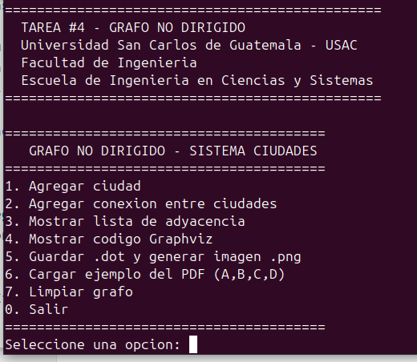
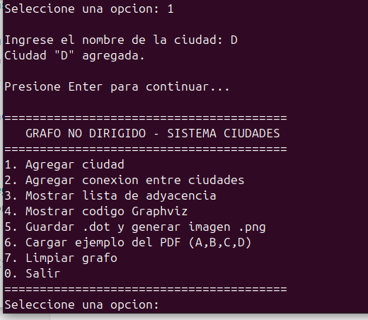
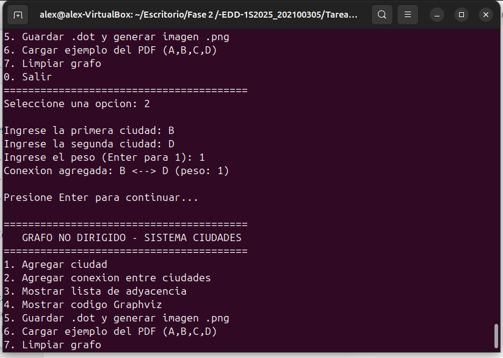
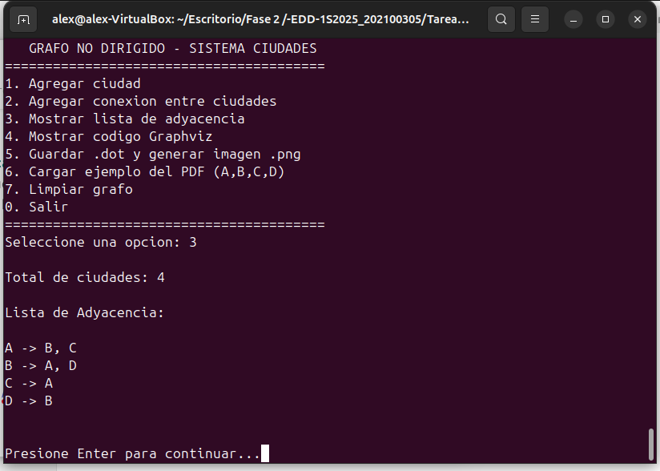
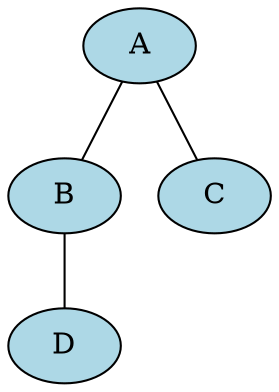
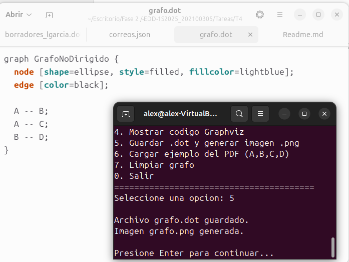
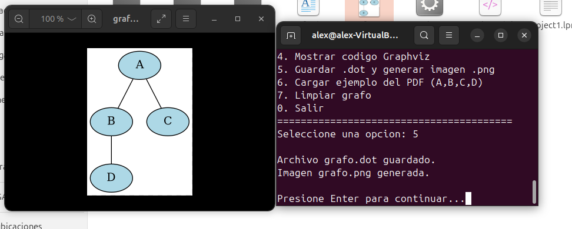

# Tarea #4 - Grafo No Dirigido

**Nombre:** José Alexander López López  
**Carné:** 202100305  
**Curso:** Estructura de Datos  
**Universidad:** Universidad San Carlos de Guatemala - USAC  
**Facultad:** Ingeniería  
**Escuela:** Ingeniería en Ciencias y Sistemas  

---

##  Descripción

Implementación de un **Grafo No Dirigido** en Free Pascal donde cada nodo representa una ciudad y cada arista representa una conexión bidireccional entre ciudades. El grafo utiliza una estructura de **lista de adyacencia** para una gestión eficiente de las conexiones.

---

##  Funcionalidades Implementadas

1.  Agregar ciudades (nodos)
2.  Agregar conexiones bidireccionales entre ciudades (aristas)
3.  Visualizar lista de adyacencia del grafo
4.  Generar código Graphviz para visualización
5.  Generar imagen PNG del grafo automáticamente
6.  Cargar ejemplo predefinido (A, B, C, D)

---

##  Estructura del Grafo Implementado

### Ejemplo del PDF (Ciudades A, B, C, D):

**Nodos (Ciudades):** A, B, C, D

**Aristas (Conexiones):**
- A ↔ B (bidireccional)
- A ↔ C (bidireccional)
- B ↔ D (bidireccional)

**Representación:** Lista de adyacencia

**Tipo:** Grafo no dirigido

---

##  Capturas de Funcionalidad

### 1. Menú Principal
El programa muestra un menú interactivo con todas las opciones disponibles.



---

### 2. Agregando Ciudades
Se agregaron las ciudades A, B, C y D al grafo usando la opción 1 del menú.



---

### 3. Agregando Conexiones
Se crearon las conexiones bidireccionales entre las ciudades:
- **A ↔ B** (peso: 1)
- **A ↔ C** (peso: 1)  
- **B ↔ D** (peso: 1)



---

### 4. Lista de Adyacencia
El grafo muestra correctamente la lista de adyacencia con todas las conexiones bidireccionales:

```
A -> B, C
B -> A, D
C -> A
D -> B
```



---

### 5. Código Graphviz
El programa genera automáticamente el código DOT para visualización en Graphviz:





---

### 6. Visualización Gráfica del Grafo
Representación visual del grafo generada con Graphviz, mostrando claramente los nodos y sus conexiones:



---

##  Compilación y Ejecución

### Requisitos:
- Free Pascal Compiler (fpc)
- Graphviz (opcional, para generar imágenes PNG)

### Instalar dependencias en Ubuntu:
```bash
sudo apt-get update
sudo apt-get install fpc graphviz
```

### Compilar el programa:
```bash
fpc project1.pas
```

### Ejecutar el programa:
```bash
./project1
```

### Uso rápido (cargar ejemplo):
```bash
./project1
# Seleccionar opción 6 (Cargar ejemplo del PDF)
# Seleccionar opción 3 (Mostrar lista de adyacencia)
# Seleccionar opción 5 (Generar .dot y .png)
```

---

##  Estructura del Código

### Clases Principales:

**TArista**
- Representa una conexión entre dos ciudades
- Almacena el destino y el peso de la conexión

**TListaAristas**
- Lista dinámica de aristas
- Maneja las conexiones de cada nodo

**TGrafoNoDirigido**
- Implementación del grafo no dirigido
- Usa TStringList para lista de adyacencia
- Métodos para agregar nodos, conexiones y generar visualizaciones

---

##  Conceptos Implementados

### Estructura de Datos:
-  Grafo No Dirigido
-  Lista de Adyacencia
-  Aristas con peso opcional

### Operaciones:
-  Inserción de nodos: O(1)
-  Inserción de aristas: O(1)
-  Visualización: O(V + E)

Donde:
- V = número de vértices (ciudades)
- E = número de aristas (conexiones)

---

##  Criterios de Calificación 

| Criterio | Descripción | Puntos | Estado |
|----------|-------------|--------|--------|
| **Inserción** | Inserción de ciudades y conexiones | 0.5 |  Cumplido |
| **Gráfico** | Visualización gráfica del grafo | 0.5 |  Cumplido |
| **Total** | | **1.0** |  |

---

##  Archivos del Proyecto

```
Tarea4_GrafoNoDirigido/
├── project1.pas              (Código fuente principal)
├── README.md                 (Este archivo)
└── capturas/                 (Carpeta con imágenes)
    ├── 01_menu_principal.png
    ├── 02_agregar_ciudades.png
    ├── 03_agregar_conexiones.png
    ├── 04_lista_adyacencia.png
    ├── 05_codigo_graphviz.png
    └── 06_grafo_visual.png
```

---

##  Conclusiones


1.  **Estructura correcta:** El grafo utiliza lista de adyacencia para representar las conexiones entre ciudades de manera eficiente.

2.  **Inserción funcionando:** Las operaciones de agregar ciudades y conexiones funcionan correctamente, creando relaciones bidireccionales como se requiere en un grafo no dirigido.

3.  **Visualización exitosa:** El programa genera correctamente el código Graphviz y produce una imagen clara del grafo que facilita su comprensión.

4.  **Código limpio y funcional:** La implementación es clara, está bien estructurada y cumple con las mejores prácticas de programación.

---

##  Información de Contacto

**Estudiante:** José Alexander López López 
**Carné:** 202100305
**Email:** iosealexander40@outlook.com 

---

**Fecha de Entrega:** 15/10/2025 
**Plataforma:** UEDI  
**Ponderación:** 2 puntos del curso  

---

*Universidad San Carlos de Guatemala - USAC*  
*Facultad de Ingeniería*  
*Escuela de Ingeniería en Ciencias y Sistemas*  
*Estructura de Datos - 2025*

